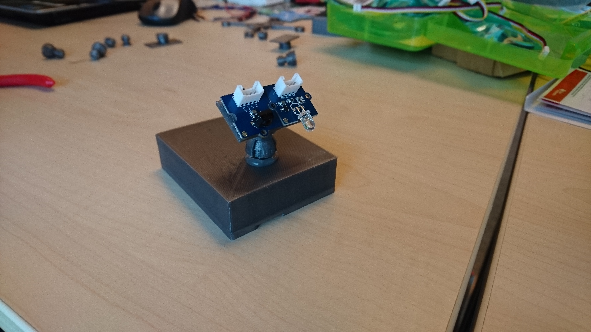
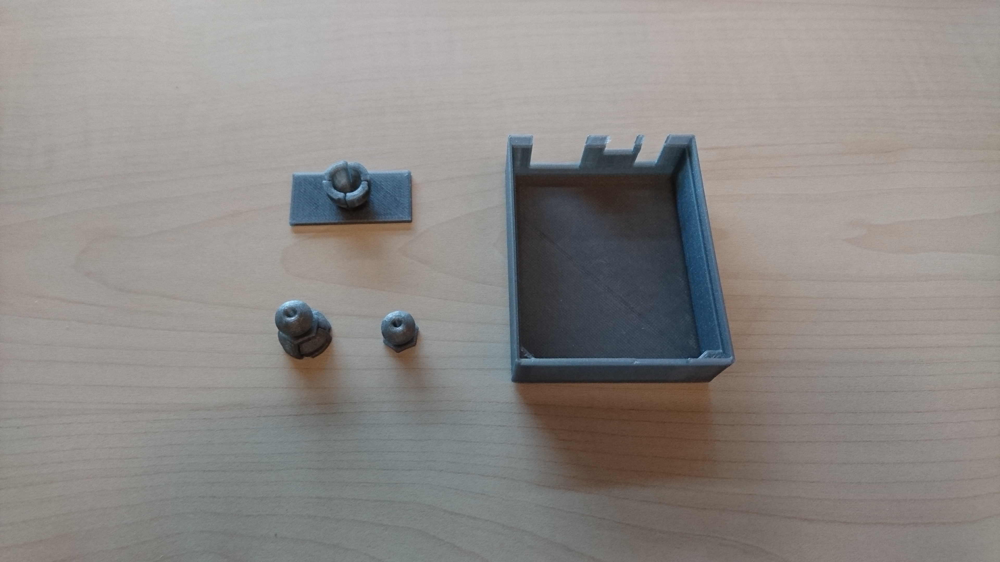

# Glad-IoT-ors
Turn your drones, remote controlled cars, robtic arms, or any other device into war machines, and let's see which one kicks the more asses!

This project includes code and 3D files that allow you to build a war module.

##Hardware

	* Arduino Yun
	* IR LED
	* IR sensor
	* 3D printed case and IR module holder
	* Vehicule, drone, robotic arm to carry the module

##Software
This project is written in ThingML (a modelisation language that allows you to generate code in other languages). In order to use this project you can either use the generated source in the thingml-gen directory, or compile the different ThingML module. (ThingML tutorial is [here](https://github.com/HEADS-project/training/tree/master/1.ThingML_Basics)).

This project includes the following modules

	* Glad-IoT-or module includes sources for both cheap of the arduino yun (ATmega32u4 and AR9331)
	* Server module should run on a Posix System

##Physical Module
3D schematic are in the 3D Printable parts folder.

